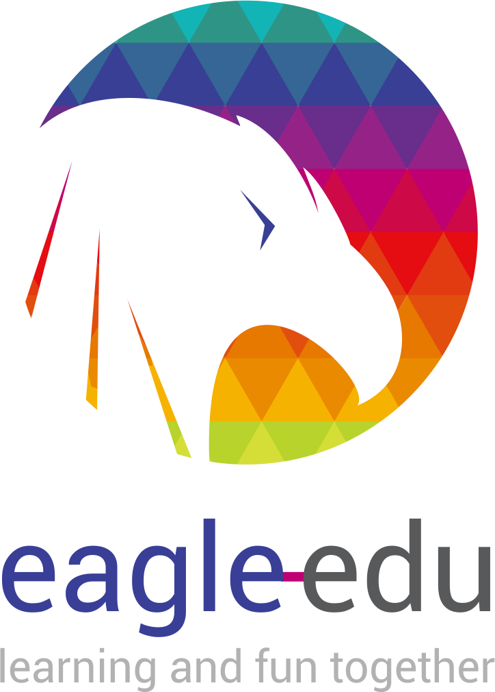
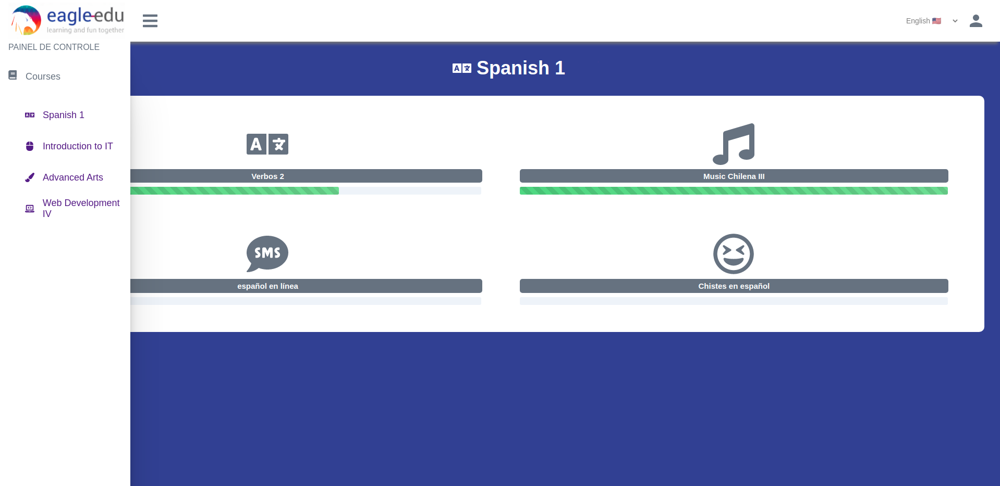
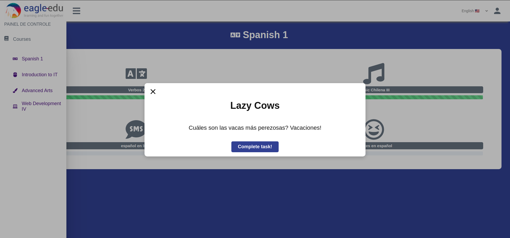
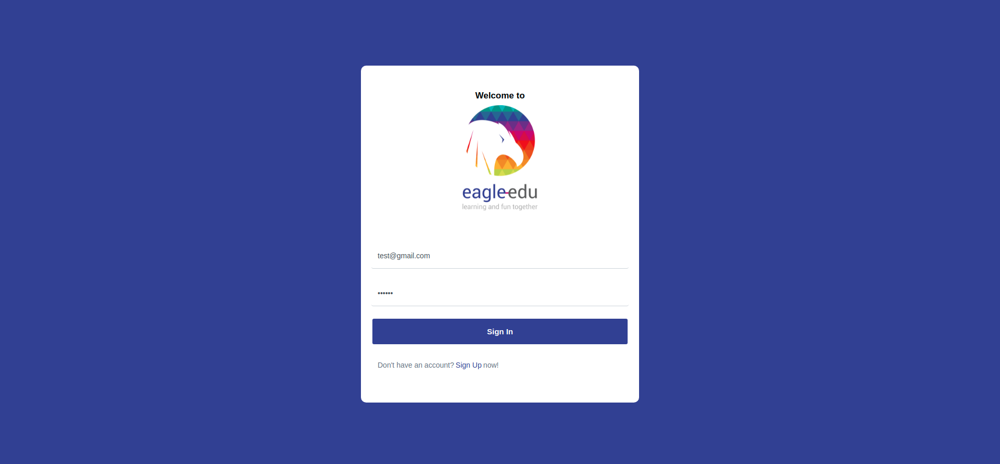

<h1 align="center">
    
    <br>
    Eagle Edu Dashboard
</h1>

<h4 align="center">
     🇺🇸   React-Based dashboard for a a gamified Tutoring System. This project is part of the selective process for a undergrad researcher and fullstack programmer position @ Eagle-edu, a Brazilian EdTech specialized in Gamified ITS (Intelligent Tutoring System)
  🇧🇷 Projeto Prático para o processo seletivo de Iniciação Científica oferecida pela Startup Eagle Education em parceria com o ICMC-USP <br>
</h4>

---

## Pictures

### Dashboard


### Mission Modal


### Login Form


---
## 🚀 Technologies

This project was with the following technologies:

-  [ReactJS](https://reactjs.org/)
-  [ReactRouter](https://reactrouter.com/web/guides/quick-start)
-  [Express](https://expressjs.com/)
-  [NodeJS](https://nodejs.org/en/)
-  [MySQL](https://www.mysql.com/)
-  [Sequelize](https://sequelize.org/)

## 🛈 How To Use

To clone and run this application, you'll need [Git](https://git-scm.com), Node.js or Yarn installed on your computer. From your command line:

```bash
# Clone this repository
$ git clone https://github.com/Muramatsu2602/eagle-edu-project

# Go into the repository
$ cd web

# Install dependencies
$ npm install

# Run the website
$ npm start

# Come back to the root
$ cd backend

# Install dependencies
$ npm install

# Execute migrations to a MySQL Database
cd backend/src/
node index

# Run the API (on another terminal tab)
$ npm start

```

---
Made with ♥ by @Muramatsu2602 👋  [Get in touch!](https://www.linkedin.com/in/muramatsu-pedro)
